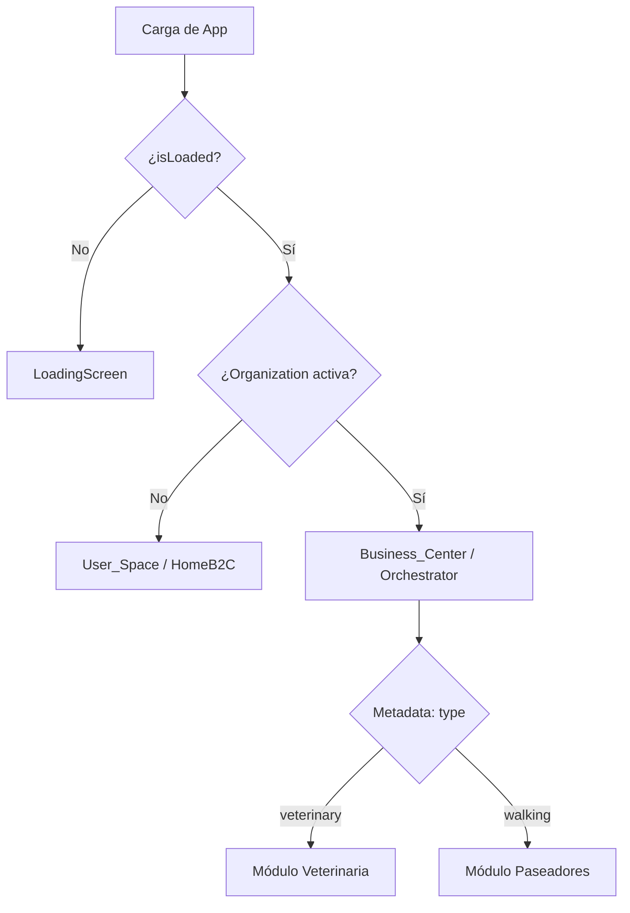

# Arquitectura PelusApp - Identidad Unificada y Multi-Contexto (v2.1)

## 📋 Resumen Ejecutivo

PelusApp ha evolucionado de un modelo de "Roles Fijos" a un ecosistema de **Identidad Unificada**. En esta arquitectura, cada usuario posee una única identidad (B2C) y puede habilitar múltiples **Espacios de Trabajo** (B2B) mediante Organizaciones de Clerk. La aplicación es ahora un sistema **Multi-tenant** y **Multi-contexto**.

---

## 🏗️ Estructura de Directorios (Modular Contexts)

```
src/
├── core/                   # 💎 Infraestructura Inmutable
│   ├── store/             # Zustand (Solo flags globales: isLoading)
│   └── types/             # Tipos base (User, Organization, UserType)
│
├── features/               # 🔑 Módulos por Contexto
│   ├── Auth/              # Login Universal y Sincronización
│   │
│   ├── User_Space/        # 🏠 Espacio Personal (B2C)
│   │   ├── screens/       # Home, Favoritos, Perfil Personal
│   │   └── components/    # WorkspaceManager (Selector de Orgs)
│   │
│   ├── Business_Center/   # 💼 Orquestador Profesional (B2B)
│   │   ├── BusinessCenterOrchestrator.tsx # Decide qué módulo profesional cargar
│   │   └── screens/       # RegisterBusinessScreen
│   │
│   └── Shared/            # UI Components & Navigation
```

---

## 🔄 Lógica de Contextos (Source of Truth)

La fuente de verdad absoluta para el contexto profesional es la **Organización Activa** en Clerk. Para el perfil universal, se utiliza una segmentación inicial.

### 1. Segmentación de Usuario (`user_type`)
Durante el onboarding, el usuario define su perfil base:
- `pet_owner`: Usuario estándar (Dueño).
- `professional`: Usuario que ofrece servicios.
Esta información se guarda en `user.publicMetadata.user_type`.

### 2. El Switcher Maestro (`app/(tabs)/index.tsx`)
El dashboard principal utiliza el patrón **Strategy** para decidir qué renderizar basándose en la reactividad de Clerk:



### 3. Navegación Sensible al Contexto
Los componentes `MobileMenu` y `Sidebar` filtran las opciones dinámicamente:
- **Contexto Personal:** Muestra pestañas como "Favoritos".
- **Contexto Profesional:** Oculta pestañas personales y muestra herramientas de gestión de negocio.

---

## 🚀 Beneficios de la Nueva Arquitectura

1.  **Identidad Híbrida:** Un veterinario puede ser también dueño de mascota sin cambiar de cuenta. Solo cambia de "espacio" usando el `WorkspaceManager` (ActionSheet).
2.  **Escalabilidad Horizontal:** Añadir una nueva vertical de negocio (ej. Paseadores) no requiere tocar la autenticación; solo se añade un nuevo módulo en `Business_Center` con su correspondiente metadata `type`.
3.  **Herencia de Roles:** Los empleados invitados heredan el contexto del negocio automáticamente a través de la metadata de la organización (`org.publicMetadata.type`).
4.  **Zero Race Conditions:** Se eliminó el `pendingRole`. La segmentación es atómica y la creación de organización cambia el contexto inmediatamente.

---

## 🎨 Design System & Estilos
Todos los componentes nuevos deben seguir estrictamente las reglas en `.cursor/rules/gluestack-styling.md`:
- **Tokens de Diseño:** Uso obligatorio del prefijo `$` (ej. `$primary600`).
- **Componentes Tematizados:** Prioridad total a `@gluestack-ui/themed`.
- **Experiencia Pro:** Uso de componentes avanzados como `Actionsheet` para selectores de contexto.

---
**Última actualización**: Diciembre 2024
**Versión de Arquitectura**: 2.1 (Segmented Identity)
