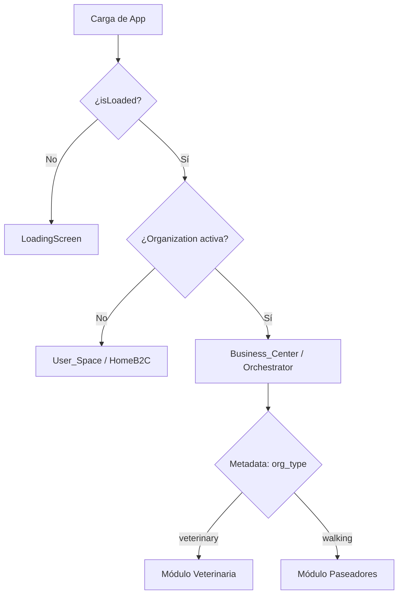

# Arquitectura PelusApp - Identidad Unificada y Multi-Contexto (v2)

## 📋 Resumen Ejecutivo

PelusApp ha evolucionado de un modelo de "Roles Fijos" a un ecosistema de **Identidad Unificada**. En esta arquitectura, cada usuario posee una única identidad (B2C) y puede habilitar múltiples **Espacios de Trabajo** (B2B) mediante Organizaciones de Clerk. La aplicación es ahora un sistema **Multi-tenant** y **Multi-contexto**.

---

## 🏗️ Estructura de Directorios (Modular Contexts)

```
src/
├── core/                   # 💎 Infraestructura Inmutable
│   ├── store/             # Zustand (Solo flags globales: isLoading, onboarding)
│   └── types/             # Tipos base (User, Organization)
│
├── features/               # 🔑 Módulos por Contexto
│   ├── Auth/              # Login Universal y Sincronización
│   │
│   ├── User_Space/        # 🏠 Espacio Personal (B2C)
│   │   ├── screens/       # Home, Favoritos, Perfil Personal
│   │   └── components/    # UI para dueños de mascotas
│   │
│   ├── Business_Center/   # 💼 Orquestador Profesional (B2B)
│   │   ├── BusinessCenterOrchestrator.tsx # Decide qué módulo profesional cargar
│   │   │
│   │   ├── Veterinary/    # 🩺 Vertical Médica (Antes B2B_Dashboard)
│   │   ├── Walking/       # 🦮 Vertical Paseos (Futuro)
│   │   └── Grooming/      # ✂️ Vertical Estética (Futuro)
│   │
│   └── Shared/            # UI Components & Navigation
```

---

## 🔄 Lógica de Contextos (Source of Truth)

La fuente de verdad absoluta ya no es un "rol" en el usuario, sino la **Organización Activa** en Clerk.

### 1. El Switcher Maestro (`app/(tabs)/index.tsx`)
El dashboard principal utiliza el patrón **Strategy** para decidir qué renderizar basándose en la reactividad de Clerk:



### 2. Navegación Sensible al Contexto
Los componentes `MobileMenu` y `Sidebar` filtran las opciones dinámicamente:
- **Contexto Personal:** Muestra pestañas como "Favoritos".
- **Contexto Profesional:** Oculta pestañas personales y muestra herramientas de gestión de negocio.

---

## 🚀 Beneficios de la Nueva Arquitectura

1.  **Identidad Híbrida:** Un veterinario puede ser también dueño de mascota sin cambiar de cuenta. Solo cambia de "espacio".
2.  **Escalabilidad Horizontal:** Añadir una nueva vertical de negocio (ej. Paseadores) no requiere tocar la autenticación ni el login; solo se añade un nuevo módulo en `Business_Center`.
3.  **Herencia de Roles:** Al usar Organizaciones, los empleados invitados heredan el contexto del negocio automáticamente a través de la metadata de la organización (`org.publicMetadata.type`).
4.  **Zero Race Conditions:** Se eliminó el `pendingRole`. Si Clerk confirma la organización, el cambio de UI es atómico y garantizado por el JWT.

---

## 🎨 Design System & Estilos
Todos los componentes nuevos deben seguir estrictamente las reglas en `.cursor/rules/gluestack-styling.md`:
- **Tokens de Diseño:** Uso obligatorio del prefijo `$` (ej. `$primary600`).
- **Componentes Tematizados:** Prioridad total a `@gluestack-ui/themed`.
- **Responsive:** Layouts adaptativos integrados en `TabsLayoutWrapper`.

---
**Última actualización**: Diciembre 2024
**Versión de Arquitectura**: 2.0 (Unified Identity)

