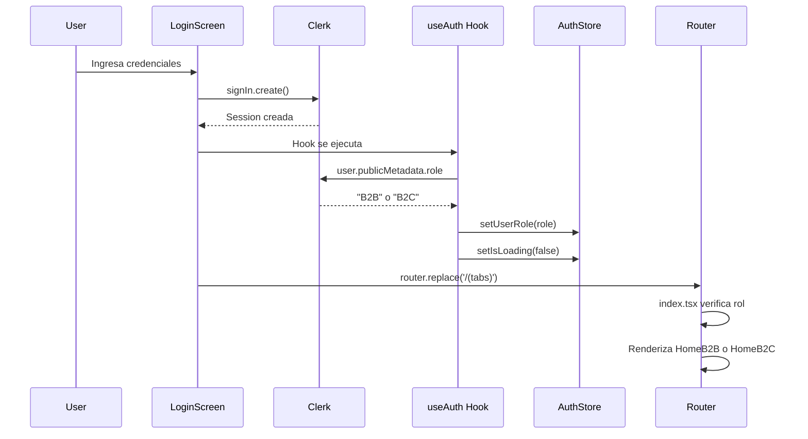

# Arquitectura - PelusAppNative

## 📋 Resumen Ejecutivo

**PelusAppNative** es una aplicación React Native multiplataforma (iOS, Android, Web) construida con **Expo SDK 51** y **Expo Router**. La aplicación implementa una arquitectura **feature-based** para soportar B2B2C, con autenticación con Clerk, manejo de roles, navegación responsiva y soporte para PWA.

---

## 🏗️ Arquitectura General

### Stack Tecnológico Principal

- **Framework**: React Native 0.74.5 con Expo ~51.0.0
- **Navegación**: Expo Router 3.5.24 (file-based routing)
- **Autenticación**: Clerk (@clerk/clerk-expo 2.19.10)
- **State Management**: Zustand 4.5.0
- **Estilos**: NativeWind 4.2.1 (Tailwind CSS para React Native)
- **Lenguaje**: TypeScript 5.1.3
- **Plataformas**: iOS, Android, Web (PWA)

### Dependencias Clave

- `expo-router`: Sistema de navegación basado en archivos
- `zustand`: State management para roles y estado global
- `@clerk/clerk-expo`: Autenticación y gestión de usuarios
- `expo-secure-store`: Almacenamiento seguro de tokens
- `babel-plugin-module-resolver`: Path aliases para imports limpios
- `react-native-safe-area-context`: Manejo de áreas seguras
- `react-native-gesture-handler`: Gestos nativos
- `react-native-reanimated`: Animaciones

---

## 📁 Estructura de Directorios (Feature-Based)

```
PelusAppNative/
├── src/
│   ├── core/                    # 💎 Infraestructura compartida
│   │   ├── services/           # Servicios de API y storage
│   │   │   ├── api.ts          # Cliente API base
│   │   │   └── storage.ts      # Token cache para Clerk
│   │   ├── store/              # Zustand stores
│   │   │   └── authStore.ts    # Estado de autenticación y roles
│   │   └── types/              # Tipos TypeScript compartidos
│   │       ├── user.ts         # Tipos de usuario, roles (B2B/B2C)
│   │       └── api.ts          # Tipos de API
│   │
│   ├── features/                # 🔑 Módulos por característica
│   │   ├── Auth/               # Autenticación
│   │   │   ├── screens/
│   │   │   │   └── LoginScreen.tsx
│   │   │   └── hooks/
│   │   │       └── useAuth.ts  # Hook para obtener rol desde Clerk
│   │   │
│   │   ├── B2B_Dashboard/      # Módulo B2B
│   │   │   ├── components/     # Componentes específicos B2B
│   │   │   └── screens/
│   │   │       ├── HomeScreen.tsx      # Dashboard B2B
│   │   │       ├── ProfileScreen.tsx  # Perfil empresarial
│   │   │       ├── SettingsScreen.tsx
│   │   │       └── HelpScreen.tsx
│   │   │
│   │   ├── B2C_Shop/           # Módulo B2C
│   │   │   ├── components/     # Componentes específicos B2C
│   │   │   └── screens/
│   │   │       ├── HomeScreen.tsx      # Tienda B2C
│   │   │       ├── FavoritesScreen.tsx
│   │   │       ├── ProfileScreen.tsx  # Perfil cliente
│   │   │       ├── SettingsScreen.tsx
│   │   │       └── HelpScreen.tsx
│   │   │
│   │   └── Shared/             # Componentes transversales
│   │       ├── components/
│   │       │   ├── navigation/
│   │       │   │   ├── MobileMenu.tsx
│   │       │   │   ├── Sidebar.tsx
│   │       │   │   ├── ResponsiveNavigation.tsx
│   │       │   │   └── TabsLayoutWrapper.tsx
│   │       │   ├── RoleGate.tsx        # Protección por roles
│   │       │   ├── LoadingScreen.tsx   # Pantalla de carga
│   │       │   └── InstallPWAButton.tsx
│   │       └── hooks/
│   │
│   └── app/                     # 🗺️ Expo Router (solo rutas)
│       ├── _layout.tsx          # Layout raíz (ClerkProvider)
│       ├── (auth)/
│       │   └── login.tsx        # Re-exporta Auth/screens/LoginScreen
│       └── (tabs)/
│           ├── _layout.tsx      # Layout de tabs
│           ├── index.tsx        # Home dinámico (B2B o B2C)
│           ├── fav.tsx          # Re-exporta B2C_Shop/screens/FavoritesScreen
│           ├── pro.tsx          # Perfil dinámico (B2B o B2C)
│           ├── settings.tsx     # Settings dinámico (B2B o B2C)
│           └── help.tsx         # Help dinámico (B2B o B2C)
│
├── assets/                      # Recursos estáticos
├── public/                      # Archivos públicos (PWA)
│   ├── manifest.json
│   └── sw.js
├── scripts/                     # Scripts de build
│   └── add-manifest-link.js
├── app.json                     # Configuración de Expo
├── package.json                 # Dependencias
├── tsconfig.json                # TypeScript con path aliases
└── babel.config.js              # Babel con module-resolver
```

---

## 🔄 Flujo de Autenticación y Roles

### Sistema de Roles

Los roles se determinan desde **Clerk metadata** (`user.publicMetadata.role`) y se almacenan en el **Zustand store** (`authStore`).



### Protección de Rutas

El sistema implementa protección de rutas en `app/_layout.tsx`:

- **Usuario autenticado** intentando acceder a `(auth)/login` → Redirige a `/(tabs)`
- **Usuario no autenticado** intentando acceder a cualquier ruta → Redirige a `/(auth)/login`

### Manejo de Loading State (Anti-Flickering)

**CRÍTICO**: El `authStore` incluye `isLoading: boolean` para evitar flickering durante la inicialización:

```typescript
// ❌ INCORRECTO - Causa flickering
const { userRole } = useAuthStore();
return userRole === 'B2B' ? <HomeB2B /> : <HomeB2C />;

// ✅ CORRECTO - Espera a que termine la carga
const { userRole, isLoading } = useAuthStore();
if (isLoading) return <LoadingScreen />;
return userRole === 'B2B' ? <HomeB2B /> : <HomeB2C />;
```

---

## 🎨 Sistema de Navegación Responsiva

### Diseño Adaptativo

La aplicación implementa un sistema de navegación que se adapta según el tamaño de pantalla:

1. **Mobile (≤ 768px)**:
   - `MobileMenu`: Bottom tab bar fijo
   - Muestra tabs según rol (B2B no ve "fav")
   - Settings y Help ocultos del tab bar

2. **Desktop (> 768px)**:
   - `Sidebar`: Barra lateral izquierda (250px)
   - Muestra items según rol (B2B no ve "Favoritos")
   - Incluye botón de "Cerrar sesión"
   - Layout horizontal (sidebar + contenido)

### Componentes de Navegación

- **`ResponsiveNavigation`**: Componente wrapper que decide qué renderizar
- **`TabsLayoutWrapper`**: Maneja el layout responsivo y filtra tabs según rol
- **`MobileMenu`**: Implementación del bottom tab bar (filtra por rol)
- **`Sidebar`**: Implementación del sidebar desktop (filtra por rol)

### Filtrado de Tabs por Rol

El `TabsLayoutWrapper` filtra tabs según el rol del usuario:

- **B2B**: index, pro, settings, help (sin fav)
- **B2C**: index, fav, pro, settings, help

---

## 🔐 Sistema de Autenticación

### Clerk Integration

- **Provider**: `ClerkProvider` en `app/_layout.tsx`
- **Token Cache**: Implementación personalizada en `src/core/services/storage.ts`
  - **Web**: `localStorage`
  - **Native**: `expo-secure-store`
- **Hooks utilizados**:
  - `useAuth()` (Clerk): Estado de autenticación
  - `useAuth()` (custom): Obtiene rol desde metadata y actualiza store
  - `useSignIn()`: Login
  - `signOut()`: Logout

### Flujo de Autenticación

1. Usuario ingresa credenciales en `LoginScreen`
2. Clerk valida y crea sesión
3. `setActive()` establece la sesión
4. `useAuth` hook obtiene `user.publicMetadata.role` de Clerk
5. Hook actualiza `authStore` con el rol y `isLoading = false`
6. Router redirige a `/(tabs)`
7. Pantallas se renderizan según el rol

---

## 📦 State Management (Zustand)

### AuthStore

El `authStore` gestiona el estado de autenticación y roles:

```typescript
interface AuthState {
  userRole: UserRole | null;  // 'B2B' | 'B2C' | null
  isLoading: boolean;         // true durante carga inicial
  setUserRole: (role: UserRole | null) => void;
  setIsLoading: (loading: boolean) => void;
  clearAuth: () => void;
}
```

**Uso**:
```typescript
const { userRole, isLoading, setUserRole } = useAuthStore();
```

---

## 🛣️ Path Aliases

El proyecto utiliza path aliases para imports más limpios:

### Configuración

**tsconfig.json**:
```json
{
  "compilerOptions": {
    "baseUrl": ".",
    "paths": {
      "@/core/*": ["./src/core/*"],
      "@/features/*": ["./src/features/*"],
      "@/shared/*": ["./src/features/Shared/*"]
    }
  }
}
```

**babel.config.js**:
```javascript
plugins: [
  [
    'module-resolver',
    {
      root: ['./src'],
      alias: {
        '@/core': './src/core',
        '@/features': './src/features',
        '@/shared': './src/features/Shared',
      },
    },
  ],
]
```

**CRÍTICO**: Los path aliases requieren configuración tanto en `tsconfig.json` (para TypeScript/IDE) como en `babel.config.js` (para tiempo de ejecución).

### Ejemplos de Uso

```typescript
import { useAuthStore } from '@/core/store/authStore';
import { LoginScreen } from '@/features/Auth/screens/LoginScreen';
import { RoleGate } from '@/shared/components/RoleGate';
```

---

## ✅ Fortalezas de la Arquitectura

1. **Arquitectura Feature-Based Escalable**
   - Separación clara por características
   - Fácil agregar nuevas features
   - Mantenimiento simplificado

2. **Soporte B2B2C**
   - Pantallas completamente separadas por rol
   - Navegación adaptada según rol
   - Lógica de negocio modular

3. **Navegación Responsiva Bien Implementada**
   - Sistema limpio de detección de breakpoints
   - Componentes separados para móvil/desktop
   - UX adaptativa funcional

4. **Autenticación Robusta**
   - Integración correcta con Clerk
   - Token cache multiplataforma
   - Protección de rutas implementada
   - Manejo de roles desde metadata

5. **State Management**
   - Zustand para estado global
   - Manejo correcto de loading states
   - Sin flickering en la UI

6. **TypeScript**
   - Configuración estricta
   - Tipado en todos los componentes
   - Path aliases configurados

7. **Estructura Modular**
   - Componentes reutilizables
   - Separación de concerns
   - Utils organizados

---

## 🎯 Decisiones de Diseño

### Por qué Feature-Based?

- **Escalabilidad**: Fácil agregar nuevas features sin afectar otras
- **Mantenibilidad**: Cada feature es independiente
- **Colaboración**: Equipos pueden trabajar en features diferentes
- **Testing**: Features pueden testearse de forma aislada

### Por qué Zustand?

- **Simplicidad**: Menos boilerplate que Redux
- **Performance**: Selectores optimizados
- **TypeScript**: Excelente soporte de tipos
- **Tamaño**: Bundle pequeño

### Por qué Path Aliases?

- **Legibilidad**: Imports más claros
- **Refactoring**: Más fácil mover archivos
- **Consistencia**: Estructura de imports uniforme

---

## 📝 Cómo Agregar una Nueva Feature

1. Crear directorio en `src/features/`:
   ```
   src/features/NuevaFeature/
   ├── components/
   ├── screens/
   ├── hooks/
   └── types.ts
   ```

2. Crear pantallas en `screens/`

3. Agregar rutas en `app/` que re-exporten desde la feature

4. Usar path aliases para imports: `@/features/NuevaFeature/...`

---

## 🔧 Configuración Técnica

### Expo Router Config

- **Entry Point**: `expo-router/entry` (definido en `package.json`)
- **File-based Routing**: Habilitado
- **Groups**: `(auth)`, `(tabs)` para organización

### Build Configuration

- **Web**: Metro bundler
- **PWA**: Manifest y service worker
- **Scripts**: `npm run build` exporta web y procesa manifest

### Environment Variables

- `EXPO_PUBLIC_CLERK_PUBLISHABLE_KEY`: Requerido para Clerk

---

## 📊 Diagrama de Arquitectura

```
┌─────────────────────────────────────────────────┐
│           Expo Application Entry                │
│         (expo-router/entry)                     │
└──────────────────┬──────────────────────────────┘
                   │
                   ▼
┌─────────────────────────────────────────────────┐
│         app/_layout.tsx                         │
│  ┌──────────────────────────────────────────┐  │
│  │  ClerkProvider                           │  │
│  │  ┌────────────────────────────────────┐  │  │
│  │  │  InitialLayout                     │  │  │
│  │  │  - useAuth() (Clerk)               │  │  │
│  │  │  - useAuth() (custom hook)         │  │  │
│  │  │  - Route Protection                │  │  │
│  │  └────────────────────────────────────┘  │  │
│  └──────────────────────────────────────────┘  │
└──────────────────┬──────────────────────────────┘
                   │
        ┌──────────┴──────────┐
        │                     │
        ▼                     ▼
┌──────────────┐    ┌──────────────────┐
│ (auth)/login │    │  (tabs)/_layout  │
│              │    │                  │
│ LoginScreen  │    │  TabsLayoutWrapper│
│              │    │  ┌─────────────┐ │
│ - Clerk Auth │    │  │ Responsive  │ │
│ - useAuth    │    │  │ Navigation  │ │
│              │    │  └──────┬──────┘ │
└──────────────┘    │         │        │
                    │  ┌──────▼──────┐ │
                    │  │   Tabs      │ │
                    │  │  (Expo)     │ │
                    │  └──────┬──────┘ │
                    └─────────┼────────┘
                              │
                ┌─────────────┼─────────────┐
                │             │             │
                ▼             ▼             ▼
        ┌───────────┐ ┌──────────┐ ┌──────────┐
        │  index    │ │   fav    │ │   pro    │
        │(Dinámico) │ │(Solo B2C)│ │(Dinámico)│
        │           │ │          │ │          │
        │ HomeB2B   │ │Favorites │ │ProfileB2B│
        │ o HomeB2C │ │  Screen  │ │ o B2C    │
        └───────────┘ └──────────┘ └──────────┘
```

---

## 🎓 Conclusión

La arquitectura actual es **escalable y bien estructurada**, utilizando una arquitectura feature-based que soporta B2B2C de forma clara y mantenible. El sistema de roles está correctamente implementado con Zustand y Clerk, evitando flickering mediante el manejo adecuado de loading states.

El sistema de navegación responsiva está **bien implementado** y la integración con Clerk es **robusta**. La estructura modular facilita el crecimiento del proyecto y la colaboración en equipo.

---

**Última actualización**: Diciembre 2024
**Versión del proyecto**: 1.0.0
**Arquitectura**: Feature-Based B2B2C
