# Arquitectura PelusApp - Identidad Unificada y Multi-Contexto (v2.2)

## 📋 Resumen Ejecutivo

PelusApp ha evolucionado de un modelo de "Roles Fijos" a un ecosistema de **Identidad Unificada**. En esta arquitectura, cada usuario posee una única identidad (B2C) y puede habilitar múltiples **Espacios de Trabajo** (B2B) mediante Organizaciones de Clerk. La aplicación es ahora un sistema **Multi-tenant** y **Multi-contexto**, donde la seguridad de la identidad se gestiona exclusivamente desde el backend.

---

## 🏗️ Estructura de Directorios (Modular Contexts)

```
src/
├── core/                   # 💎 Infraestructura Inmutable
│   ├── store/             # Zustand (Solo flags globales de UI)
│   ├── services/          # Clientes API con Auth (JWT)
│   └── types/             # Tipos base (User, Organization, UserType)
│
├── features/               # 🔑 Módulos por Contexto
│   ├── Auth/              # Login Universal y Sincronización Segura
│   │
│   ├── User_Space/        # 🏠 Espacio Personal (B2C)
│   │   ├── screens/       # Home, Favoritos, Perfil Personal
│   │   └── components/    # WorkspaceManager (ActionSheet Context Switcher)
│   │
│   ├── Business_Center/   # 💼 Orquestador Profesional (B2B)
│   │   ├── BusinessCenterOrchestrator.tsx # Carga de módulos por org.publicMetadata.type
│   │   └── screens/       # RegisterBusinessScreen (Registro B2B)
│   │
│   └── Shared/            # UI Components & Navigation (Independiente de Features)
```

---

## 🔄 Lógica de Contextos & Seguridad (Source of Truth)

La fuente de verdad absoluta para el contexto profesional es la **Organización Activa** en Clerk. La identidad del usuario es **Backend-Driven**.

### 1. Segmentación de Usuario (`user_type`)
Durante el onboarding, el usuario define su perfil base:
- `pet_owner`: Usuario estándar (Dueño).
- `professional`: Usuario que ofrece servicios.
Esta información se guarda en `user.publicMetadata.user_type` mediante una **Netlify Function** segura para evitar manipulación desde el cliente.

### 2. El Switcher Maestro (`app/(tabs)/index.tsx`)
El dashboard principal utiliza el patrón **Strategy** para decidir qué renderizar basándose en la reactividad de Clerk:

```mermaid
graph TD
    A[Carga de App] --> B{¿isLoaded?}
    B -- No --> C[LoadingScreen]
    B -- Sí --> D{¿Organization activa?}
    
    D -- No --> E[User_Space / HomeB2C]
    D -- Sí --> F[Business_Center / Orchestrator]
    
    F --> G{Metadata: type}
    G -- veterinary --> H[Módulo Veterinaria]
    G -- walking --> I[Módulo Paseadores]
    G -- NULL --> J[Error: Configuración Pendiente]
```



### 3. Navegación Sensible al Contexto
Los componentes `MobileMenu` y `Sidebar` filtran las opciones dinámicamente basándose en la presencia de una organización activa.

---

## 🔐 Gobernanza de Datos (Metadata Hierarchy)

Para asegurar la integridad del sistema, se sigue estrictamente esta jerarquía:
- **Public Metadata**: (Backend-only write) Almacena `user_type` y `org_type`. Fuente de verdad para la UI.
- **Unsafe Metadata**: (Client-side) Solo para preferencias no críticas (ej. onboarding temporal).
- **Private Metadata**: (Backend-only) Datos sensibles (IDs de pago, flags internos).

---

## 🎨 Design System & Estilos
Todos los componentes deben seguir el **Design System** definido en `.cursor/rules/gluestack-styling.md`:
- **Tokens**: Uso obligatorio de `$` (ej. `$primary600`).
- **Contexto**: Uso de `ActionSheet` para selectores de contexto en móvil.

## 💾 Capa de Persistencia (Supabase + Clerk RLS)

La persistencia de datos se gestiona mediante **Supabase**, utilizando un sistema de seguridad **Zero-Trust** basado en el JWT de Clerk.

### 1. El Cliente Autenticado (`useSupabaseClient`)
Cada petición a la base de datos se realiza con un token fresco inyectado automáticamente. Esto permite que Supabase identifique al usuario y aplique políticas de seguridad a nivel de fila (RLS) sin necesidad de un backend intermediario para cada consulta.

### 2. Seguridad Multi-Tenant
- **B2C**: Filtro automático por `auth.uid()` (mapeado al ID de Clerk).
- **B2B**: Filtro dinámico usando el claim `org_id` del JWT de Clerk.

---
**Última actualización**: Diciembre 2025
**Versión de Arquitectura**: 2.3 (Supabase Native Integration)
