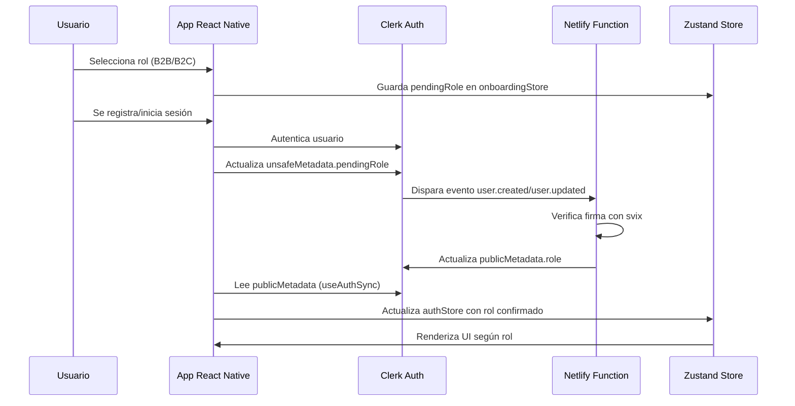
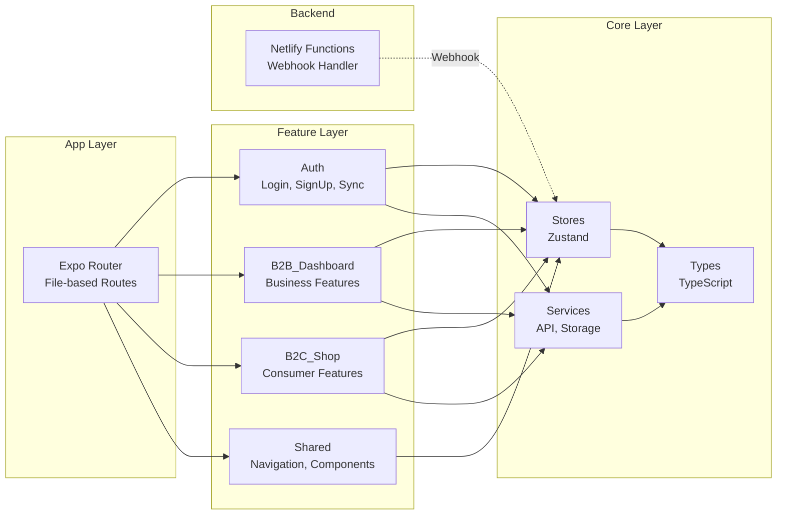

# Informe de Arquitectura - PelusAppNative

## Resumen Ejecutivo

PelusAppNative es una aplicación multiplataforma (iOS, Android, Web) construida con React Native y Expo, que implementa un modelo de negocio B2B2C. La aplicación utiliza una arquitectura basada en características (feature-based) que separa claramente las responsabilidades entre módulos de negocio (B2B y B2C), autenticación, y componentes compartidos.

## Stack Tecnológico

- **Framework**: React Native 0.74.5 con Expo SDK ~51.0.0
- **Navegación**: Expo Router 3.5.24 (file-based routing)
- **Autenticación**: Clerk (@clerk/clerk-expo)
- **Estado Global**: Zustand 4.5.7
- **Estilos**: NativeWind 4.2.1 (Tailwind CSS para React Native)
- **UI Components**: Gluestack UI
- **Backend Functions**: Netlify Functions
- **Lenguaje**: TypeScript 5.1.3 (modo estricto)
- **PWA**: Service Worker y Web Manifest

## Árbol de Carpetas Recursivo

```
PelusAppNative/
├── .cursor/                          # Configuración de Cursor IDE
│   └── plans/                        # Planes de desarrollo guardados
│       ├── eliminar_parpadeo_auth_336246d8.plan.md
│       └── planInicio.md
│
├── .expo/                            # Cache y configuración de Expo
│   ├── devices.json                  # Dispositivos registrados
│   └── web/                          # Build cache para web
│
├── app/                              # Expo Router - Sistema de rutas basado en archivos
│   ├── _layout.tsx                   # Layout raíz (ClerkProvider wrapper)
│   ├── index.tsx                     # Punto de entrada (redirige a loading)
│   │
│   ├── (auth)/                       # Grupo de rutas de autenticación
│   │   ├── login.tsx                 # Ruta /login
│   │   └── signup.tsx                # Ruta /signup
│   │
│   ├── (initial)/                    # Grupo de rutas iniciales (onboarding)
│   │   ├── _layout.tsx               # Layout para rutas iniciales
│   │   ├── loading.tsx               # Pantalla de carga inicial
│   │   ├── role-select.tsx           # Selección de rol (B2B/B2C)
│   │   └── (onboarding)/             # Subgrupo de onboarding
│   │       ├── b2b.tsx               # Onboarding específico B2B
│   │       └── b2c.tsx               # Onboarding específico B2C
│   │
│   └── (tabs)/                       # Grupo de rutas con navegación por tabs
│       ├── _layout.tsx               # Layout con TabsLayoutWrapper
│       ├── index.tsx                 # Ruta / (Home)
│       ├── fav.tsx                   # Ruta /fav (Favoritos)
│       ├── pro.tsx                   # Ruta /pro (Perfil)
│       ├── help.tsx                  # Ruta /help (Ayuda)
│       └── settings.tsx              # Ruta /settings (Configuración)
│
├── assets/                           # Recursos estáticos
│   └── favicon.png                   # Favicon de la aplicación
│
├── dist/                             # Build de producción (generado)
│   ├── index.html                    # HTML principal
│   ├── manifest.json                 # PWA manifest
│   ├── sw.js                         # Service Worker
│   └── _expo/                        # Assets compilados por Expo
│
├── netlify/                          # Backend Functions (Netlify)
│   ├── functions/                    # Serverless functions
│   │   ├── webhook-clerk.ts          # Webhook handler para eventos de Clerk
│   │   └── utils/                    # Utilidades para functions
│   │       └── clerkService.ts        # Servicio para actualizar usuarios en Clerk
│   └── netlify.toml                   # Configuración de Netlify (build, redirects, headers)
│
├── public/                           # Archivos públicos para PWA
│   ├── manifest.json                 # Manifest de PWA
│   └── sw.js                         # Service Worker base
│
├── scripts/                          # Scripts de build y utilidades
│   └── add-manifest-link.js          # Script que agrega link al manifest en HTML
│
├── src/                              # Código fuente principal
│   │
│   ├── core/                         # Infraestructura compartida (core)
│   │   ├── services/                 # Servicios de infraestructura
│   │   │   ├── api.ts                # Cliente API base (preparado para futuras implementaciones)
│   │   │   └── storage.ts            # Token cache para Clerk (SecureStore/localStorage)
│   │   │
│   │   ├── store/                    # Stores de Zustand (estado global)
│   │   │   ├── authStore.ts          # Store de autenticación (rol, onboarding, loading)
│   │   │   └── onboardingStore.ts    # Store temporal para rol pendiente (pendingRole)
│   │   │
│   │   └── types/                    # Tipos TypeScript compartidos
│   │       ├── api.ts                # Tipos para respuestas API
│   │       └── user.ts               # Tipos de usuario (UserRole, User)
│   │
│   └── features/                     # Módulos por característica (feature-based)
│       │
│       ├── Auth/                     # Módulo de Autenticación
│       │   ├── hooks/                # Custom hooks
│       │   │   └── useAuthSync.ts    # Hook que sincroniza estado de Clerk con Zustand
│       │   └── screens/              # Pantallas de autenticación
│       │       ├── LoginScreen.tsx   # Pantalla de login
│       │       └── SignUpScreen.tsx  # Pantalla de registro
│       │
│       ├── B2B_Dashboard/            # Módulo B2B (Business to Business)
│       │   ├── components/           # Componentes específicos B2B (vacío actualmente)
│       │   └── screens/             # Pantallas del dashboard B2B
│       │       ├── HomeScreen.tsx    # Home del dashboard B2B
│       │       ├── ProfileScreen.tsx # Perfil B2B
│       │       ├── SettingsScreen.tsx # Configuración B2B
│       │       └── HelpScreen.tsx   # Ayuda B2B
│       │
│       ├── B2C_Shop/                 # Módulo B2C (Business to Consumer)
│       │   ├── components/          # Componentes específicos B2C (vacío actualmente)
│       │   └── screens/             # Pantallas de la tienda B2C
│       │       ├── HomeScreen.tsx    # Home de la tienda
│       │       ├── FavoritesScreen.tsx # Favoritos
│       │       ├── ProfileScreen.tsx # Perfil B2C
│       │       ├── SettingsScreen.tsx # Configuración B2C
│       │       └── HelpScreen.tsx   # Ayuda B2C
│       │
│       └── Shared/                   # Componentes y utilidades compartidas
│           ├── components/          # Componentes transversales
│           │   ├── InstallPWAButton.tsx # Botón para instalar PWA
│           │   ├── LoadingScreen.tsx    # Pantalla de carga genérica
│           │   ├── RoleGate.tsx        # Componente que protege rutas por rol
│           │   └── navigation/         # Componentes de navegación
│           │       ├── MobileMenu.tsx  # Menú móvil (bottom tabs)
│           │       ├── Sidebar.tsx     # Sidebar para desktop
│           │       ├── ResponsiveNavigation.tsx # Componente que decide MobileMenu/Sidebar
│           │       └── TabsLayoutWrapper.tsx # Wrapper que adapta tabs a móvil/desktop
│           └── hooks/                # Hooks compartidos (vacío actualmente)
│
├── .env                              # Variables de entorno (no versionado)
├── .env.example                      # Ejemplo de variables de entorno
├── .gitignore                        # Archivos ignorados por Git
├── .npmrc                            # Configuración de npm
│
├── app.json                          # Configuración de Expo (nombre, iconos, plugins)
├── babel.config.js                   # Configuración de Babel (path aliases, NativeWind)
├── global.css                        # Estilos globales de Tailwind
├── metro.config.js                   # Configuración de Metro bundler (NativeWind)
├── nativewind-env.d.ts               # Tipos TypeScript para NativeWind
├── package.json                      # Dependencias y scripts del proyecto
├── package-lock.json                 # Lock file de dependencias
├── README.md                         # Documentación principal del proyecto
├── tailwind.config.js                # Configuración de Tailwind CSS
└── tsconfig.json                     # Configuración de TypeScript (path aliases, strict mode)
```

## Explicación Detallada por Elemento

### Configuración Raíz

**`app.json`**: Configuración principal de Expo. Define nombre, versión, iconos, splash screen, plugins (expo-router, expo-secure-store), y configuraciones específicas por plataforma (iOS, Android, Web). La configuración web incluye soporte PWA.

**`package.json`**: Gestiona todas las dependencias del proyecto. Scripts principales:

- `start`: Inicia servidor de desarrollo
- `dev`: Inicia con dev client
- `build`: Exporta para web y procesa manifest

**`tsconfig.json`**: Configuración de TypeScript con modo estricto. Define path aliases:

- `@/core/*` → `src/core/*`
- `@/features/*` → `src/features/*`
- `@/shared/*` → `src/features/Shared/*`

**`babel.config.js`**: Configuración de Babel con:

- `babel-preset-expo` con NativeWind
- `module-resolver` para path aliases
- `react-native-worklets/plugin` (debe ser último)

**`metro.config.js`**: Configura Metro bundler para integrar NativeWind con el archivo `global.css`.

**`tailwind.config.js`**: Configuración de Tailwind CSS para React Native. Incluye preset de NativeWind y modo dark como 'class'.

**`netlify.toml`**: Configuración de Netlify:

- Comando de build
- Directorio de publicación (`dist`)
- Redirects para SPA (todas las rutas a `/index.html`)
- Headers para Service Worker y manifest

### Directorio `app/` (Expo Router)

Expo Router usa file-based routing. La estructura de carpetas define las rutas automáticamente.

**`app/_layout.tsx`**: Layout raíz que:

- Envuelve la app con `ClerkProvider`
- Configura token cache (SecureStore/localStorage)
- Maneja errores de chunk loading de Clerk en web
- Importa estilos globales

**`app/index.tsx`**: Punto de entrada que redirige a la pantalla de carga inicial.

**`app/(auth)/`**: Grupo de rutas de autenticación (paréntesis = grupo sin afectar URL):

- `login.tsx`: Ruta `/login` - renderiza `LoginScreen`
- `signup.tsx`: Ruta `/signup` - renderiza `SignUpScreen`

**`app/(initial)/`**: Rutas del flujo inicial:

- `_layout.tsx`: Layout que maneja redirecciones según estado de auth
- `loading.tsx`: Pantalla de carga mientras se verifica autenticación
- `role-select.tsx`: Selección de rol (B2B/B2C) antes de autenticación
- `(onboarding)/`: Subgrupo de onboarding:
  - `b2b.tsx`: Onboarding específico para usuarios B2B
  - `b2c.tsx`: Onboarding específico para usuarios B2C

**`app/(tabs)/`**: Rutas principales con navegación por tabs:

- `_layout.tsx`: Layout que renderiza `TabsLayoutWrapper` (navegación responsiva)
- `index.tsx`: Ruta `/` - Home (renderiza según rol)
- `fav.tsx`: Ruta `/fav` - Favoritos (solo B2C)
- `pro.tsx`: Ruta `/pro` - Perfil
- `help.tsx`: Ruta `/help` - Ayuda (oculta en tab bar, accesible desde menú)
- `settings.tsx`: Ruta `/settings` - Configuración (oculta en tab bar)

### Directorio `src/core/` (Infraestructura Compartida)

**`src/core/services/api.ts`**: Cliente API base preparado para futuras implementaciones. Define interfaz `ApiClient` con métodos GET, POST, PUT, DELETE y tipo `ApiResponse<T>`.

**`src/core/services/storage.ts`**: Implementa `TokenCache` de Clerk:

- Web: usa `localStorage`
- Mobile: usa `expo-secure-store`
- Proporciona abstracción multiplataforma para almacenamiento seguro

**`src/core/store/authStore.ts`**: Store de Zustand para estado de autenticación:

- `userRole`: Rol actual del usuario (B2B/B2C/null)
- `isLoading`: Estado de carga inicial
- `hasCompletedOnboarding`: Si completó onboarding
- Acciones: `setUserRole`, `setIsLoading`, `setHasCompletedOnboarding`, `clearAuth`

**`src/core/store/onboardingStore.ts`**: Store temporal para manejar rol pendiente:

- `pendingRole`: Rol seleccionado antes de que webhook lo procese
- Se limpia cuando el rol se confirma desde Clerk metadata

**`src/core/types/user.ts`**: Tipos TypeScript:

- `UserRole`: 'B2B' | 'B2C'
- `User`: Interfaz de usuario con id, email, role

**`src/core/types/api.ts`**: Tipos para respuestas API:

- `ApiResponse<T>`: Estructura genérica de respuesta

### Directorio `src/features/` (Módulos por Característica)

#### `src/features/Auth/`

**`hooks/useAuthSync.ts`**: Hook crítico que sincroniza estado de Clerk con Zustand:

- Lee `user.publicMetadata.role` y `hasCompletedOnboarding` de Clerk
- Actualiza `authStore` y `onboardingStore`
- Maneja casos edge:
  - Usuario existente con rol
  - Usuario nuevo con `pendingRole`
  - Usuario sin metadata (fallback)
- Previene loops infinitos usando dependencias optimizadas

**`screens/LoginScreen.tsx`**: Pantalla de login usando componentes de Clerk.

**`screens/SignUpScreen.tsx`**: Pantalla de registro usando componentes de Clerk.

#### `src/features/B2B_Dashboard/`

Módulo completo para usuarios B2B. Cada pantalla está adaptada al contexto B2B.

**`screens/HomeScreen.tsx`**: Dashboard principal B2B.

**`screens/ProfileScreen.tsx`**: Perfil y configuración de cuenta B2B.

**`screens/SettingsScreen.tsx`**: Configuración específica B2B.

**`screens/HelpScreen.tsx`**: Ayuda y soporte B2B.

#### `src/features/B2C_Shop/`

Módulo completo para usuarios B2C (tienda).

**`screens/HomeScreen.tsx`**: Home de la tienda B2C.

**`screens/FavoritesScreen.tsx`**: Lista de productos favoritos (solo B2C).

**`screens/ProfileScreen.tsx`**: Perfil del consumidor.

**`screens/SettingsScreen.tsx`**: Configuración B2C.

**`screens/HelpScreen.tsx`**: Ayuda B2C.

#### `src/features/Shared/`

Componentes y utilidades compartidas entre módulos.

**`components/RoleGate.tsx`**: Componente de protección por rol:

- Renderiza contenido solo si el usuario tiene el rol requerido
- Usado para mostrar/ocultar funcionalidades según rol

**`components/LoadingScreen.tsx`**: Pantalla de carga genérica reutilizable.

**`components/InstallPWAButton.tsx`**: Botón para instalar la app como PWA (solo web).

**`components/navigation/TabsLayoutWrapper.tsx`**: Componente que adapta navegación a móvil/desktop:

- Detecta tamaño de pantalla (`useWindowDimensions`)
- Móvil (< 768px): Tabs en bottom con `MobileMenu`
- Desktop (≥ 768px): Sidebar fijo a la izquierda
- Captura props de `tabBar` sin causar loops de renderizado

**`components/navigation/ResponsiveNavigation.tsx`**: Componente que decide qué renderizar:

- Renderiza `MobileMenu` o `Sidebar` según contexto
- Recibe props de navegación de Expo Router

**`components/navigation/MobileMenu.tsx`**: Menú de navegación móvil:

- Bottom tabs sticky
- Muestra solo rutas relevantes según rol
- Iconos y navegación optimizada para touch

**`components/navigation/Sidebar.tsx`**: Sidebar para desktop:

- Navegación vertical fija
- Muestra todas las rutas con iconos
- Filtrado por rol

### Directorio `netlify/` (Backend Serverless)

**`netlify/functions/webhook-clerk.ts`**: Handler del webhook de Clerk:

- Valida método HTTP (POST)
- Verifica firma del webhook con `svix` (seguridad crítica)
- Procesa eventos `user.created` y `user.updated`
- Lee `unsafeMetadata.pendingRole`
- Llama a `clerkService` para actualizar `publicMetadata.role`
- Maneja race conditions (usuario creado antes de que app actualice metadata)
- Idempotente: no procesa si el usuario ya tiene rol asignado

**`netlify/functions/utils/clerkService.ts`**: Servicio para actualizar usuarios en Clerk:

- Usa `clerkClient` de `@clerk/clerk-sdk-node`
- Actualiza `publicMetadata` con rol y `hasCompletedOnboarding: true`
- Limpia `unsafeMetadata.pendingRole` después de procesar

### Directorio `public/` (PWA)

**`public/manifest.json`**: Web App Manifest para PWA:

- Define nombre, iconos, colores, display mode
- Permite instalar la app como PWA

**`public/sw.js`**: Service Worker base para funcionalidades PWA (caché, offline).

### Scripts y Utilidades

**`scripts/add-manifest-link.js`**: Script post-build que:

- Agrega `<link rel="manifest">` al HTML generado
- Necesario porque Expo no lo agrega automáticamente

### Archivos de Configuración Adicionales

**`.env`**: Variables de entorno locales (no versionado):

- `EXPO_PUBLIC_CLERK_PUBLISHABLE_KEY`: Clave pública de Clerk
- `EXPO_PUBLIC_API_URL`: URL base de API (opcional)

**`.env.example`**: Template de variables de entorno para nuevos desarrolladores.

**`global.css`**: Estilos globales de Tailwind CSS importados en el layout raíz.

**`nativewind-env.d.ts`**: Declaraciones de tipos TypeScript para NativeWind (clases de Tailwind en className).

## Flujo de Datos y Arquitectura

### Flujo de Autenticación y Asignación de Rol



### Arquitectura de Navegación

```mermaid
graph TD
    A[app/_layout.tsx<br/>ClerkProvider] --> B[app/index.tsx]
    B --> C{Usuario autenticado?}
    C -->|No| D[app/(auth)/login]
    C -->|Sí| E{¿Tiene rol?}
    E -->|No| F[app/(initial)/role-select]
    E -->|Sí| G{¿Completó onboarding?}
    G -->|No| H[app/(initial)/(onboarding)/b2b o b2c]
    G -->|Sí| I[app/(tabs)/_layout]
    I --> J[TabsLayoutWrapper]
    J --> K{¿Pantalla grande?}
    K -->|Sí| L[Sidebar Desktop]
    K -->|No| M[MobileMenu Bottom Tabs]
    L --> N[app/(tabs)/index]
    M --> N
    N --> O{¿Rol B2B?}
    O -->|Sí| P[B2B_Dashboard/HomeScreen]
    O -->|No| Q[B2C_Shop/HomeScreen]
```

### Separación de Responsabilidades



## Patrones de Diseño Implementados

1. **Feature-Based Architecture**: Separación por características de negocio (B2B, B2C, Auth)
2. **Separation of Concerns**: Core (infraestructura) separado de Features (lógica de negocio)
3. **Container/Presentational**: Screens como contenedores, componentes como presentacionales
4. **Custom Hooks**: Lógica reutilizable encapsulada (useAuthSync)
5. **State Management**: Zustand para estado global, estado local con useState cuando corresponde
6. **Provider Pattern**: ClerkProvider envuelve toda la app
7. **Adapter Pattern**: storage.ts adapta SecureStore/localStorage
8. **Idempotency**: Webhook procesa eventos de forma idempotente

## Consideraciones de Seguridad

- Verificación de firma de webhook con `svix` (previene ataques)
- Tokens almacenados en SecureStore (mobile) o localStorage (web)
- Variables de entorno sensibles no versionadas
- Validación de roles en cliente y servidor (webhook)
- Manejo de errores sin exponer información sensible

## Escalabilidad

La arquitectura está diseñada para escalar:

- Nuevas features: Agregar módulo en `src/features/`
- Nuevos roles: Extender tipo `UserRole` y agregar módulos correspondientes
- Nuevas rutas: Crear archivos en `app/` siguiendo convenciones de Expo Router
- Backend: Agregar nuevas Netlify Functions en `netlify/functions/`
- API: Implementar métodos en `src/core/services/api.ts`

## Puntos de Mejora Futuros

1. Implementar cliente API completo en `api.ts`
2. Agregar tests unitarios y de integración
3. Implementar caché de datos con React Query o SWR
4. Agregar internacionalización (i18n)
5. Implementar analytics y error tracking
6. Agregar componentes específicos en `B2B_Dashboard/components` y `B2C_Shop/components`
7. Optimizar bundle size con code splitting
8. Agregar E2E tests con Detox o Maestro

