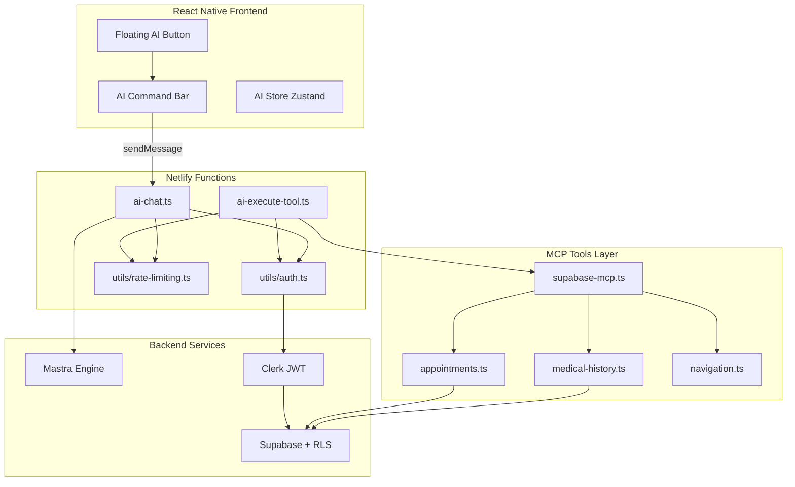
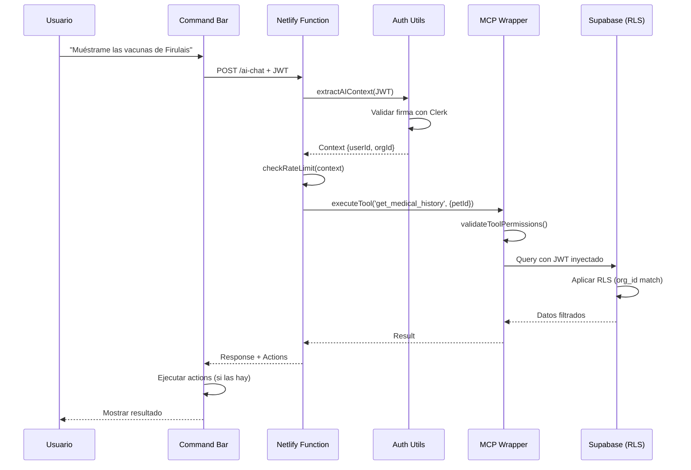

# Arquitectura AI-First de PelusApp

**Versión:** 1.0  
**Fecha:** Enero 2026  
**Estado:** Fase 1 Implementada

## Resumen Ejecutivo

PelusApp integra agentes de IA usando Mastra como orquestador y MCP (Model Context Protocol) como puente de datos, manteniendo la seguridad Zero-Trust multi-tenant existente.

### Capacidades Implementadas

1. **Agente Veterinario**: Consulta historias clínicas, agenda citas, busca en inventario
2. **Navegación Asistida**: Comandos de lenguaje natural para moverse por la app
3. **Rate Limiting**: Control de uso por tipo de usuario
4. **Seguridad RLS**: JWT pass-through para políticas de fila en Supabase

---

## 1. Arquitectura General



---

## 2. Flujo de Seguridad Zero-Trust

### Paso a Paso

1. **Usuario escribe en AI Command Bar**
   - Input capturado por `AICommandBar.tsx`
   - Hook `useAIChat` prepara request con contexto

2. **Request al Backend**
   ```typescript
   POST /ai-chat
   Headers: { Authorization: "Bearer <JWT_CLERK>" }
   Body: {
     messages: [...],
     context: { userId, orgId, activeLocationId, userType }
   }
   ```

3. **Validación en Netlify Function**
   - `withAIAuth` middleware valida JWT con Clerk SDK
   - Extrae claims: `user_id`, `org_id`, `active_location_id`
   - Verifica rate limit según tipo de usuario

4. **Ejecución de Tool MCP**
   - `executeMCPTool` valida permisos con `validateToolPermissions`
   - Crea cliente Supabase con JWT inyectado
   - El RLS de Supabase filtra automáticamente los datos

5. **Respuesta al Frontend**
   - Message del asistente
   - Actions opcionales (ej: navegación)
   - Frontend ejecuta actions via `useAIActions`

### Diagrama de Seguridad



---

## 3. Estructura de Archivos

### Frontend (`src/features/AI_Core/`)

```
AI_Core/
├── agents/
│   ├── veterinaryAgent.ts       # Config agente veterinario
│   └── navigationAgent.ts       # Config agente navegación
├── tools/
│   └── index.ts                 # Definiciones de tools (schemas)
├── hooks/
│   ├── useAIChat.ts            # Hook principal de chat
│   └── useAIActions.ts         # Hook para ejecutar actions
├── components/
│   ├── AICommandBar.tsx        # UI principal de chat
│   └── AIFloatingButton.tsx    # Botón flotante
└── services/
    └── aiClient.ts             # Cliente HTTP para functions
```

### Backend (`netlify/functions/`)

```
functions/
├── ai-chat.ts                  # Endpoint principal
├── ai-execute-tool.ts          # Ejecución directa de tools
├── utils/
│   ├── auth.ts                 # JWT validation + context extraction
│   ├── rate-limiting.ts        # Control de uso
│   └── cors.ts                 # CORS headers (ya existía)
└── mcp-tools/
    ├── supabase-mcp.ts         # Wrapper MCP custom
    ├── medical-history.ts      # Tools de historias clínicas
    ├── appointments.ts         # Tools de citas
    └── navigation.ts           # Tools de navegación
```

### Estado Global (`src/core/store/`)

```typescript
// aiStore.ts
interface AIStore {
  messages: AIMessage[];
  isCommandBarOpen: boolean;
  pendingActions: AIAction[];
  // ... métodos
}
```

---

## 4. MCP Tools Disponibles

### 1. get_medical_history

**Descripción**: Obtiene historial médico de una mascota  
**Permisos**: B2B (profesionales) o B2C (dueño de la mascota)  
**RLS**: Automático por `org_id` o `owner_id`

```typescript
Parameters: {
  petId: string;
  limit?: number;
}
```

### 2. schedule_appointment

**Descripción**: Agenda una cita veterinaria  
**Permisos**: Solo B2B con sede activa  
**RLS**: Requiere `org_id` y `active_location_id`

```typescript
Parameters: {
  petId: string;
  dateTime: string;
  reason: string;
  duration?: number;
}
```

### 3. search_inventory

**Descripción**: Busca productos en inventario  
**Permisos**: Solo B2B  
**Estado**: Pendiente (tabla de inventario no existe)

### 4. navigate_to_route

**Descripción**: Navega a una pantalla  
**Permisos**: Todos (sin rate limit)  
**Return**: Action de navegación

```typescript
Parameters: {
  screen: string;
  params?: Record<string, any>;
}
```

### 5. find_pet_and_navigate

**Descripción**: Busca mascota por nombre y navega  
**Permisos**: Según RLS de tabla pets  
**Combina**: Búsqueda + navegación

---

## 5. Rate Limiting

### Configuración por Tipo de Usuario

| Tipo de Usuario | Límite | Ventana | Notas |
|---|---|---|---|
| B2C (pet_owner) | 5 requests | 1 hora | Navegación exenta |
| B2B (professional) | 100 requests | 24 horas | Por organización |
| Sin contexto | 2 requests | 1 hora | Muy restrictivo |

### Tools Exentos de Rate Limit

- `navigate_to_route`
- `find_pet_and_navigate`
- `navigate_to_medical_history`

### Implementación

```typescript
// En memoria (desarrollo)
// Producción: usar Redis/Upstash
const requestCounts: Map<string, { count: number; resetAt: number }>;

// Clave:
// - B2C: userId
// - B2B: orgId (compartido entre todos)
```

---

## 6. Decisiones Arquitectónicas

### ¿Por qué Mastra?

- Soporte nativo para MCP
- Orquestación flexible de agentes
- Multi-provider LLM (OpenAI, Anthropic, local)

### ¿Por qué MCP Custom?

El MCP oficial de Supabase no soporta:
- Inyección de contexto JWT
- Validación de permisos pre-ejecución
- Modelo diamante de sedes (active_location_id)

### ¿Por qué Netlify Functions?

- Backend ya existente
- Sin infraestructura adicional
- Despliegue automático
- Variables de entorno centralizadas

### ¿Por qué ActionSheet vs Modal?

- ActionSheet es nativo en móvil
- Mejor UX que modal full-screen
- Consistente con diseño de PelusApp

---

## 7. Fases de Implementación

### ✅ Fase 1: Fundamentos (Completada)

- [x] Estructura `AI_Core/`
- [x] Netlify Functions con autenticación
- [x] MCP wrapper custom
- [x] 3 tools básicos implementados
- [x] AI Command Bar UI
- [x] Sistema de navegación asistida
- [x] Rate limiting
- [x] Actualización de gobernanza

### 🔄 Fase 2: Agente Veterinario (Próxima)

- [ ] Integración completa con Mastra
- [ ] LLM provider configurado (OpenAI/Anthropic)
- [ ] Prompts optimizados
- [ ] Testing exhaustivo de RLS
- [ ] UI mejorada (historial persistente)

### 📅 Fase 3: Optimización

- [ ] Caching con Upstash/Redis
- [ ] Streaming de respuestas
- [ ] Multi-provider con fallback
- [ ] Comandos de voz (expo-speech)
- [ ] Analytics de uso

### 📅 Fase 4: Expansión

- [ ] Más tools MCP (inventario, facturas, reportes)
- [ ] Agentes especializados por tipo de negocio
- [ ] Integración con calendarios externos
- [ ] Notificaciones inteligentes

---

## 8. Instalación y Setup

### Dependencias Requeridas

```bash
npm install @mastra/core @mastra/anthropic @mastra/openai
```

### Variables de Entorno

```env
# Proveedor de LLM
AI_PROVIDER=openai

# API Keys
OPENAI_API_KEY=sk-...
ANTHROPIC_API_KEY=sk-ant-...

# Ya configuradas:
SUPABASE_URL=...
SUPABASE_ANON_KEY=...
CLERK_SECRET_KEY=...
```

### Testing Local

```bash
# Iniciar Netlify Dev
npm run dev:netlify

# En otra terminal, iniciar Expo
npm run dev

# Abrir AI Command Bar y probar:
# - "Llévame al inicio"
# - "Muéstrame las vacunas de Firulais" (requiere datos)
```

---

## 9. Mejores Prácticas

### Para Desarrolladores

1. **Nuevas Tablas**: Siempre crear tools MCP correspondientes
2. **Tools MCP**: Documentar permisos requeridos en comentarios
3. **Testing**: Validar que RLS filtra correctamente entre orgs
4. **Error Handling**: Mensajes claros y accionables para el usuario

### Para Prompt Engineering

1. **System Prompts**: Mantener bajo 300 tokens
2. **Context Window**: Limitar historial a últimos 10 mensajes
3. **Tool Calls**: Validar parámetros antes de ejecutar
4. **Respuestas**: Mantener tono profesional y empático

### Para Seguridad

1. **JWT**: NUNCA almacenar en logs
2. **Service Role Key**: Solo para operaciones admin, no para tools MCP
3. **Rate Limiting**: Revisar regularmente los límites
4. **Audit Logs**: Monitorear tool executions para patrones anómalos

---

## 10. Troubleshooting

### Error: "Rate limit exceeded"

- **Causa**: Usuario alcanzó límite de requests
- **Solución**: Esperar al reset o revisar config en `rate-limiting.ts`

### Error: "Unauthorized"

- **Causa**: JWT inválido o expirado
- **Solución**: Refresh del token en el frontend (Clerk lo hace automáticamente)

### Error: "RLS policy violation"

- **Causa**: Usuario intenta acceder a datos fuera de su contexto
- **Solución**: Verificar que `org_id`/`user_id` en el JWT coincidan con los datos

### Tool no retorna datos

- **Causa**: RLS filtra todo (contexto incorrecto)
- **Debug**: 
  1. Verificar JWT en headers
  2. Revisar políticas RLS en Supabase
  3. Probar query directamente en Supabase Dashboard con el mismo JWT

---

## 11. Métricas y Monitoreo

### KPIs a Monitorear

- Requests por usuario/organización (rate limiting)
- Latencia promedio de tools MCP
- Tasa de error por tool
- Comandos de navegación más usados
- Costo por request LLM

### Logs Importantes

```typescript
// Tool Execution
'[MCP Tool Audit]': {
  tool, userId, orgId, locationId, 
  success, duration, timestamp
}

// Rate Limiting
'[Rate Limit]': {
  remaining, resetAt, userId/orgId
}

// Errors
'[AI Function Error]': error.message
```

---

## 12. Referencias

- [Arquitectura General](../ARQUITECTURA.md)
- [Seguridad Backend](./BACKEND_SECURITY.md)
- [Estructura de Features](./FEATURE_STRUCTURE.md)
- [Supabase Integration](./SUPABASE_INTEGRATION.md)
- [Mastra Documentation](https://mastra.ai/docs)
- [Model Context Protocol](https://modelcontextprotocol.io)

---

**Última actualización:** Enero 2026  
**Próxima revisión:** Después de Fase 2 (integración Mastra completa)
